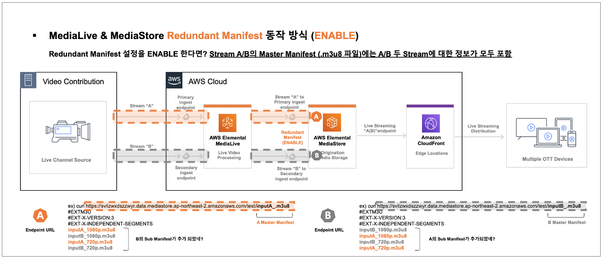
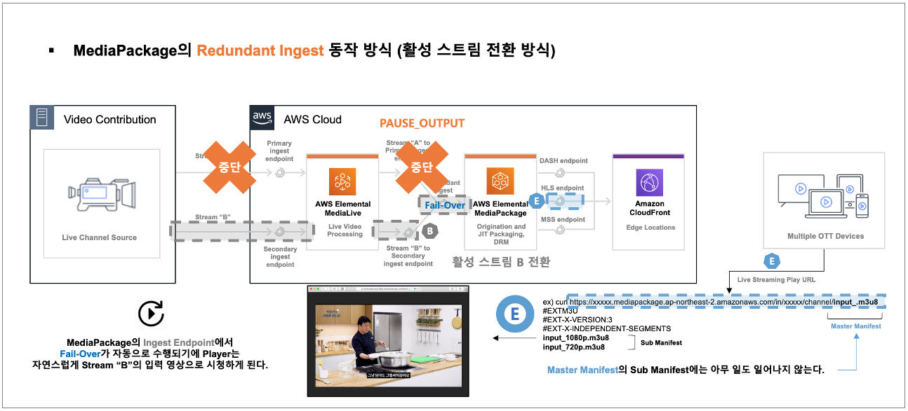
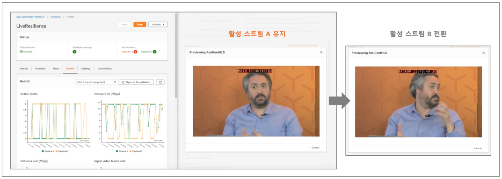

# AWS-Elemental-MediaLive

* * *

### # AWS MediaLive Fail-Over 동작 방식

- [1] AWS MediaLive & MediaStore Fail-Over 동작 방식
- [2] AWS MediaLive & MediaPackage Fail-Over 동작 방식

* * *

#### [1] AWS MediaLive & MediaStore Fail-Over 동작 방식 (상세)

- 1-1. AWS Elemental MediaLive & MediaStore 이중화 채널 구성화면
    - 라이브 스트리밍 이중화 채널 구성에서 재생할 수 있는 Manifest 주소가 파이프라인 별 1개씩 생성 (A와 B 2개)

- 1-2. AWS Elemental MediaStore를 미디어 스토리지로 사용한 구성 시 Fail-Over?
    - Fail-Over를 위해 Redundant Manifest 설정과 Puase Output이란 설정 활성화가 필요

- 1-3. AWS Elemental MediaLive에서 Redundant Manifest을 비활성화 할 경우?
    - 위 화면과 같이 채널의 파이프라인은 A 또는 B 파이프라인 각각에 해당하는 자신의 Sub Manifest만 보유

 

- 1-5. AWS Elemental MediaLive에서 Redundant Manifest을 활성화 할 경우?
    - 위 화면과 같이 채널의 파이프라인은 A 와 B 파이프라인에 해당하는 두 곳의 Sub Manifest를 보유

 

-  1-6. 채널의 파이프라인이 A 와 B 파이프라인에 해당하는 두 곳의 Sub Manifest를 바라보게 될 경우 동작 방식
    - 파이프라인 A의 송출이 끊어져도 A의 Master Manifest로 B의 Sub Manifest 주소를 불러와 재생되는 방식

- 1-7. 해당 동작이 가능하기 위해서는 AWS Elemental MediaLive에서 위와 같은 설정이 필요

    - [HLS OutputGroup] > [Manifest and Segments] > [Redundant Manifest] > ENABLED
    - [HLS OutputGroup] > [HLS settings] > [Input Loss Action] PAUSE_OUTPUT

 

* * *

#### [2] AWS MediaLive & MediaPackage Fail-Over 동작 방식 (상세)

- 2-1. AWS Elemental MediaLive & MediaPackage 이중화 채널 구성화면
    - 라이브 스트리밍 이중화 채널 구성에서 재생할 수 있는 Manifest 재생 주소가 1개만 생성
    - MediaStore 구성과는 다르게 파이프라인의 Fail-Over 전환이 내부적으로 처리되기에 재생 주소는 1개만 생성

- 2-2. AWS Elemental MediaPackage를 미디어 스토리지로 사용한 구성 시 Fail-Over?
    - Fail-Over를 위해 Puase Output이란 설정 활성화만 필요

- MediaLive로의 A 파이프라인이 송출이 중단되면 PAUSE_OUTPUT 동작으로 MediaPackage에 더 이상 스트림을 보내지 않음

 

- MediaLive에서 A 파이프라인의 스트림이 입수되지 않음을 알게 된 MediaPackage는 활성 스트림을 B로 전환

 

- 2-3. 채AWS Elemental MediaPackage를 미디어 스토리지로 사용한 구성 시 Fail-Over 동작 방식
    - 즉, 파이프라인 A의 송출이 끊어져도 MediaPackage에서 사용 가능한 활성 스트림을 자동으로 전환하는 방식
    - MediaPackage 내부적으로 Fail-Over 전환이 발생하기에 사용자가 재생하는 Manifest 재생 주소는 1개

 

- 2-4. 해당 동작이 가능하기 위해서는 AWS Elemental MediaLive에서 위와 같은 설정이 필요

    - [HLS OutputGroup] > [HLS settings] > [Input Loss Action] PAUSE_OUTPUT

 

* * *

 #### AWS MediaLive & MediaPackage Fail-Over 동작 방식 (참고 사이트)   

- 실제 라이브 스트리밍 파이프라인이 MediaPackage에서 Fail-Over 되는 예제를 살펴볼 수 있다.
https://www.youtube.com/watch?time_continue=48&v=5eBkZInd8kQ&feature=emb_logo

 

- 원활한 MediaPackage의 Fail-Over를 위해 MediaLive에서는 위와 같은 설정이 필요할 수 있다.
https://aws.amazon.com/ko/blogs/media/part1-how-to-set-up-a-resilient-end-to-end-live-workflow/

 
