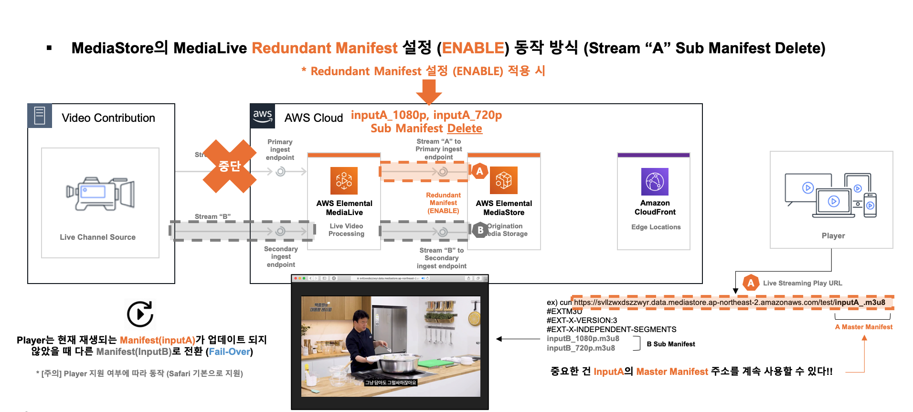
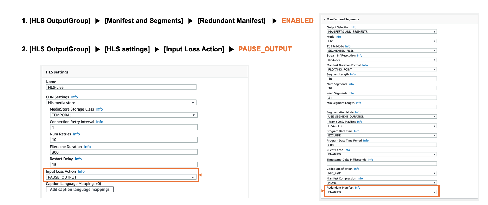

# AWS-Elemental-MediaLive

* * *

### # AWS MediaLive Fail-Over Workflow

[1] AWS MediaLive & MediaStore Fail-Over
[2] AWS MediaLive & MediaPackage Fail-Over

- Automating MediaConvert Jobs with Lambda (GitHub AWS 샘플 예제)  
https://github.com/aws-samples/aws-media-services-simple-vod-workflow/tree/master/7-MediaConvertJobLambda

 

* * *

### # Automating MediaConvert Jobs with Lambda (Hands-On : Step)

- [1] MediaConvert IAM Role 생성 (vod-MediaConvertRole)  
https://github.com/aws-samples/aws-media-services-simple-vod-workflow/tree/master/1-IAMandS3

- [2] Automating MediaConvert Jobs with Lambda 진행  
https://github.com/aws-samples/aws-media-services-simple-vod-workflow/tree/master/7-MediaConvertJobLambda

 

Hands-On 실습은 [1]에서 IAM Role 생성 후 [2] 진행을 권장

Hands-On 실습이 완료되면 아래와 같은 절차로 MediaConvert & Lambda 자동화 구성이 가능하다. 

 

 

* AWS Tokyo 리전 MediaConvert & Lambda 자동화 구성 Hands-On 실습 캡처 화면 
