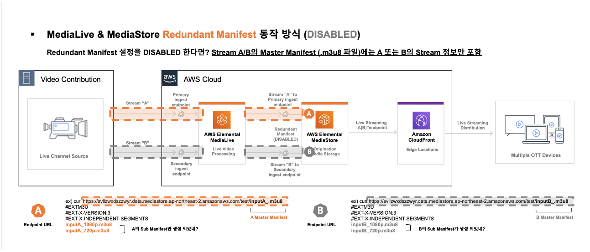
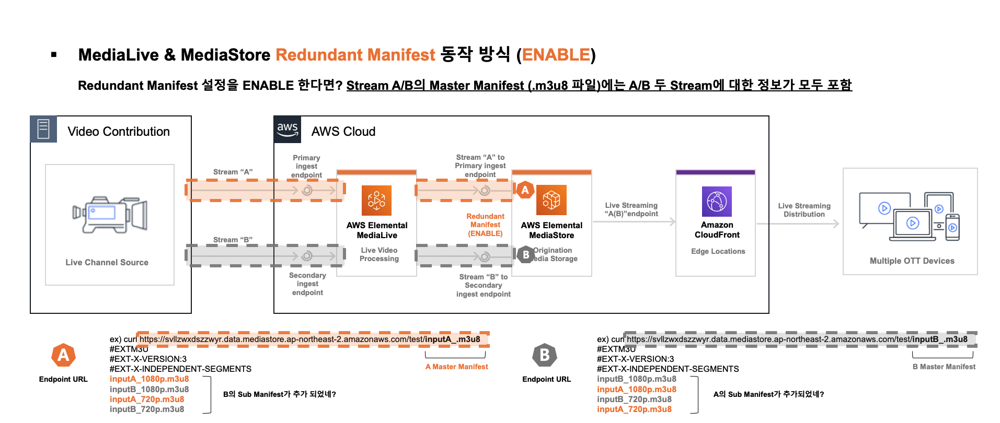
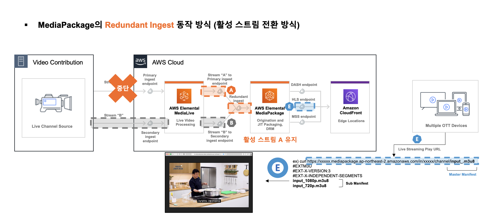
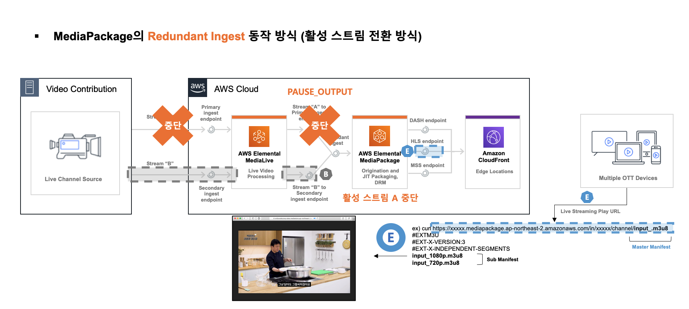
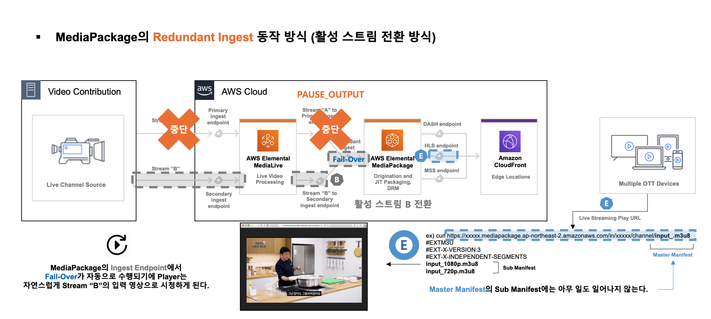
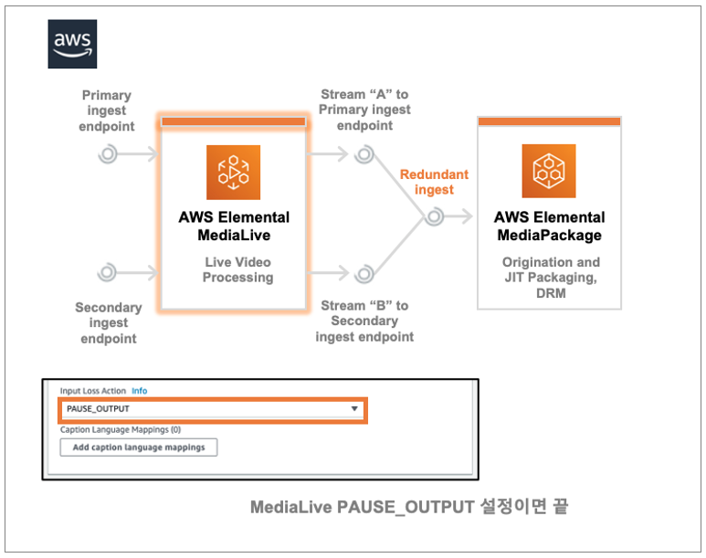
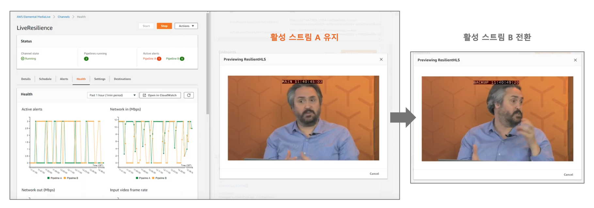

# AWS-Elemental-MediaLive

* * *

### # AWS MediaLive Fail-Over 동작 방식

- [1] AWS MediaLive & MediaStore Fail-Over 동작 방식
- [2] AWS MediaLive & MediaPackage Fail-Over 동작 방식

* * *

#### [1] AWS MediaLive & MediaStore Fail-Over 동작 방식 (상세)

- 1-1. AWS Elemental MediaLive & MediaStore를 이중화 채널로 구성 했을 때의 구성도 위와 같다.

- 1-2. AWS Elemental MediaStore를 미디어 스토리지로 사용한 구성에서는 이중화 채널의 Fail-Over를 위해 Redundant Manifest 설정과 Puase Output이란 설정 활성화가 필요하다.

- 1-3. AWS Elemental MediaLive에서 Redundant Manifest을 비활성화 할 경우  
위 화면과 같이 채널의 파이프라인은 A 또는 B 파이프라인 각각에 해당하는 자신의 Sub Manifest만 보유하게 된다.

 

1-5. AWS Elemental MediaLive에서 Redundant Manifest을 활성화 할 경우  
위 화면과 같이 채널의 파이프라인은 A 와 B 파이프라인에 해당하는 두 곳의 Sub Manifest를 보유하게 된다.

 

-  1-6. 채널의 파이프라인이 A 와 B 파이프라인에 해당하는 두 곳의 Sub Manifest를 바라보게 될 경우
파이프라인 A의 송출이 끊어져도 A의 Master Manifest로 B의 Sub Manifest 주소를 불러와 재생되는 방식이다.

- 1-7. 해당 동작이 가능하기 위해서는 AWS Elemental MediaLive에서 위와 같은 설정이 필요하다.

    - [HLS OutputGroup] > [Manifest and Segments] > [Redundant Manifest] > ENABLED
    - [HLS OutputGroup] > [HLS settings] > [Input Loss Action] PAUSE_OUTPUT

 

* * *

#### [2] AWS MediaLive & MediaPackage Fail-Over 동작 방식 (상세)

Hands-On 실습은 [1]에서 IAM Role 생성 후 [2] 진행을 권장

Hands-On 실습이 완료되면 아래와 같은 절차로 MediaConvert & Lambda 자동화 구성이 가능하다. 

Hands-On 실습이 완료되면 아래와 같은 절차로 MediaConvert & Lambda 자동화 구성이 가능하다. 

Hands-On 실습이 완료되면 아래와 같은 절차로 MediaConvert & Lambda 자동화 구성이 가능하다. 

Hands-On 실습이 완료되면 아래와 같은 절차로 MediaConvert & Lambda 자동화 구성이 가능하다. 

Hands-On 실습이 완료되면 아래와 같은 절차로 MediaConvert & Lambda 자동화 구성이 가능하다. 

 
